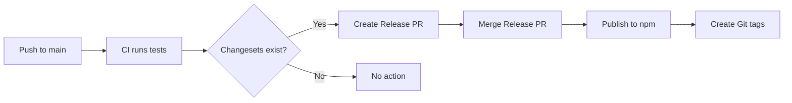

# Release Guide

This document explains how to release new versions of Gati packages to npm.

## Prerequisites

1. **npm Account**: You need an npm account with publish access
2. **NPM_TOKEN**: Set up in GitHub repository secrets
3. **Changesets**: Already configured in this repository

## Setup NPM Token (One-time)

### Step 1: Generate npm Access Token

1. Go to https://www.npmjs.com/
2. Log in to your account
3. Click on your profile → "Access Tokens"
4. Click "Generate New Token" → "Classic Token"
5. Select "Automation" type (for CI/CD)
6. Copy the token (starts with `npm_...`)

### Step 2: Add Token to GitHub Secrets

1. Go to your GitHub repository
2. Navigate to: **Settings** → **Secrets and variables** → **Actions**
3. Click "New repository secret"
4. Name: `NPM_TOKEN`
5. Value: Paste your npm token
6. Click "Add secret"

## How It Works

### Automatic Release Process



### Workflow Steps

1. **Developer makes changes** and creates a changeset
2. **Push to main** triggers the release workflow
3. **CI runs** (lint, test, build)
4. **Changesets Action**:
   - If changesets exist → Creates/updates a "Version Packages" PR
   - If "Version Packages" PR is merged → Publishes to npm

## Creating a Release

### Step 1: Make Your Changes

```bash
# Make your code changes
git checkout -b feat/my-feature
# ... make changes ...
```

### Step 2: Create a Changeset

```bash
# Run changeset CLI
pnpm changeset

# Follow the prompts:
# 1. Select packages to version (space to select, enter to confirm)
# 2. Choose version bump type:
#    - patch: Bug fixes (0.0.X)
#    - minor: New features (0.X.0)
#    - major: Breaking changes (X.0.0)
# 3. Write a summary of changes
```

This creates a file in `.changeset/` directory.

### Step 3: Commit and Push

```bash
git add .
git commit -m "feat: add new feature"
git push origin feat/my-feature
```

### Step 4: Create Pull Request

Create a PR to `main` branch. Once approved and merged, the release process begins automatically.

### Step 5: Merge "Version Packages" PR

After your PR is merged:
1. A bot will create a "Version Packages" PR
2. This PR updates package versions and CHANGELOGs
3. Review and merge this PR
4. **Packages are automatically published to npm!**

## Manual Release (if needed)

If you need to publish manually:

```bash
# 1. Build all packages
pnpm build

# 2. Version packages (updates package.json and CHANGELOG)
pnpm changeset version

# 3. Commit version changes
git add .
git commit -m "chore: version packages"
git push

# 4. Publish to npm
pnpm changeset publish

# 5. Push tags
git push --follow-tags
```

## Changeset Types

### Patch (0.0.X)

Bug fixes, documentation updates, minor improvements.

```bash
pnpm changeset
# Select: patch
# Summary: "fix: resolve memory leak in handler pipeline"
```

### Minor (0.X.0)

New features, non-breaking changes.

```bash
pnpm changeset
# Select: minor
# Summary: "feat: add Timescape API versioning system"
```

### Major (X.0.0)

Breaking changes, API changes.

```bash
pnpm changeset
# Select: major
# Summary: "BREAKING: change module initialization API"
```

## Example Changeset

After running `pnpm changeset`, a file is created in `.changeset/`:

```markdown
---
"@gati-framework/runtime": minor
"@gati-framework/cli": minor
---

feat(timescape): Add automatic API versioning

- Implemented version registry with semantic tagging
- Added automatic version detection on file changes
- Created CLI commands for version management
```

## Package Versioning Strategy

Gati uses **independent versioning** for packages:

- `@gati-framework/runtime` - Core runtime (currently 0.x.x)
- `@gati-framework/cli` - CLI tool (currently 0.x.x)
- `@gati-framework/core` - Core types (currently 0.x.x)

Each package can have different versions based on changes.

## Pre-release Versions

For beta/alpha releases:

```bash
# Enter pre-release mode
pnpm changeset pre enter beta

# Create changesets as normal
pnpm changeset

# Version and publish
pnpm changeset version
pnpm changeset publish

# Exit pre-release mode
pnpm changeset pre exit
```

## Troubleshooting

### "npm ERR! 403 Forbidden"

**Cause**: Invalid or expired NPM_TOKEN

**Solution**:
1. Generate a new npm token
2. Update GitHub secret `NPM_TOKEN`
3. Re-run the workflow

### "No changesets found"

**Cause**: No changeset files in `.changeset/` directory

**Solution**:
1. Run `pnpm changeset` to create one
2. Commit and push

### "Version already exists"

**Cause**: Trying to publish a version that already exists on npm

**Solution**:
1. Run `pnpm changeset version` to bump version
2. Commit and push

### Build Fails in CI

**Cause**: TypeScript errors or test failures

**Solution**:
1. Run `pnpm build` locally to check for errors
2. Run `pnpm test` locally
3. Fix errors and push again

## Monitoring Releases

### Check Release Status

1. Go to **Actions** tab in GitHub
2. Look for "Release" workflow
3. Check the status and logs

### Verify npm Publication

```bash
# Check latest version on npm
npm view @gati-framework/runtime version

# Check all versions
npm view @gati-framework/runtime versions
```

### Check Package on npm

Visit: https://www.npmjs.com/package/@gati-framework/runtime

## Best Practices

1. **Always create changesets** for user-facing changes
2. **Write clear summaries** in changesets (they become CHANGELOG entries)
3. **Test locally** before pushing (`pnpm build && pnpm test`)
4. **Review "Version Packages" PR** before merging
5. **Use semantic versioning** correctly:
   - Patch: Backwards-compatible bug fixes
   - Minor: Backwards-compatible features
   - Major: Breaking changes
6. **Don't skip CI** - Let tests run before merging

## Release Checklist

Before releasing a major version:

- [ ] All tests passing
- [ ] Documentation updated
- [ ] CHANGELOG reviewed
- [ ] Breaking changes documented
- [ ] Migration guide created (if needed)
- [ ] Examples updated
- [ ] README updated

## Emergency Rollback

If a bad version is published:

```bash
# Deprecate the bad version
npm deprecate @gati-framework/runtime@0.5.0 "This version has critical bugs, use 0.5.1 instead"

# Or unpublish (only within 72 hours)
npm unpublish @gati-framework/runtime@0.5.0
```

## Support

For questions or issues with releases:
- Open an issue: https://github.com/krishnapaul242/gati/issues
- Email: krishnapaulmailbox@gmail.com

---

**Last Updated**: 2025-11-22
**Maintained by**: Krishna Paul
