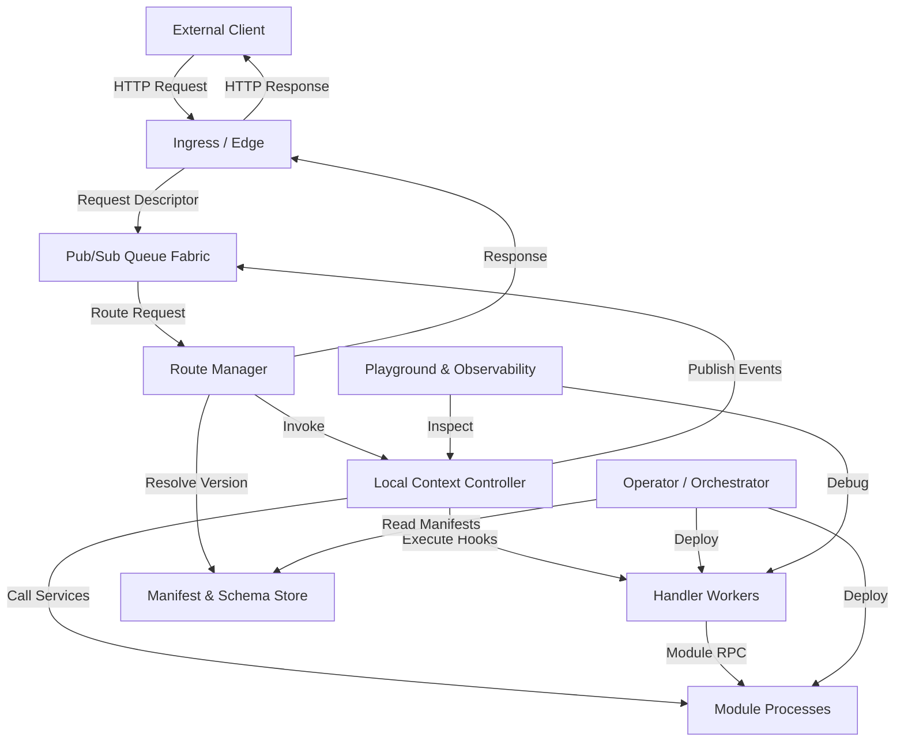
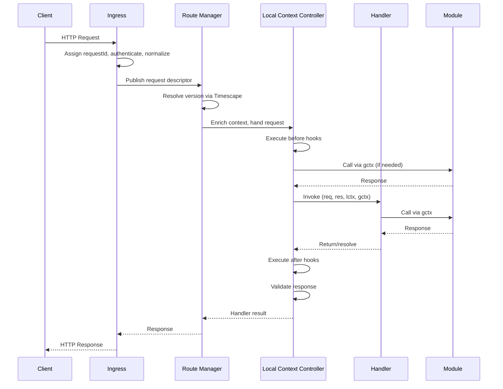
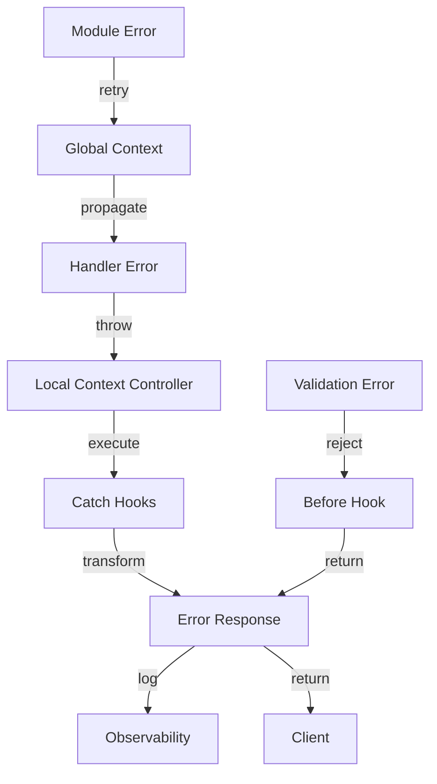

# Design Document

## Overview

The Gati Runtime & Context Architecture implements a distributed, version-aware request processing system that enables developers to write minimal handler code while the platform manages routing, lifecycle orchestration, and multi-version deployments. The architecture consists of several key components working together: Ingress for request normalization, Route Manager for version resolution and routing, Local Context Controller for lifecycle orchestration, Handler Workers for stateless execution, Module Processes for polyglot services, and a Pub/Sub Queue Fabric for asynchronous task management.

The system is built around two core context models: Local Context (lctx) for per-request ephemeral state and lifecycle hooks, and Global Context (gctx) for shared runtime services. This separation enables fault isolation, horizontal scaling, and clean separation of concerns. The architecture integrates deeply with Timescape for version management, enabling zero-downtime deployments with automatic GType-based compatibility checking and transformer execution.

## Architecture

### Component Diagram



### Request Flow Sequence



## Components and Interfaces

### Ingress / Edge

**Responsibilities:**
- Receive external HTTP/HTTPS requests
- Authenticate requests using JWT, API keys, or OAuth tokens
- Normalize HTTP headers and request metadata
- Assign unique request IDs with embedded metadata (path, version preference, priority, debug flags)
- Publish request descriptors to the routing fabric
- Return responses to clients

**Interface:**
```typescript
interface IngressComponent {
  handleRequest(rawRequest: IncomingRequest): Promise<void>;
  authenticate(request: IncomingRequest): Promise<AuthResult>;
  normalizeHeaders(headers: Headers): NormalizedHeaders;
  assignRequestId(request: IncomingRequest): RequestId;
  publishToRoutingFabric(descriptor: RequestDescriptor): Promise<void>;
}

interface RequestDescriptor {
  requestId: string;
  path: string;
  method: string;
  headers: NormalizedHeaders;
  body: Buffer;
  versionPreference?: string;
  priority: number;
  flags: string[];
}
```

### Route Manager (RM)

**Responsibilities:**
- Resolve handler versions using Timescape based on path and version preference
- Maintain local cache of manifests, GTypes, and handler health status
- Enforce rate limiting and authentication policies from manifests
- Route requests to appropriate handler instances
- Maintain warm pools for critical handler versions
- Track handler usage for auto-decommissioning

**Interface:**
```typescript
interface RouteManager {
  resolveVersion(path: string, versionPreference?: string): Promise<HandlerVersion>;
  enforceRateLimit(handlerId: string, clientId: string): Promise<boolean>;
  verifyAuthentication(handlerId: string, authContext: AuthContext): Promise<boolean>;
  routeRequest(descriptor: RequestDescriptor): Promise<HandlerInstance>;
  maintainWarmPool(handlerId: string, config: WarmPoolConfig): void;
  trackUsage(handlerId: string, metrics: UsageMetrics): void;
}

interface HandlerVersion {
  handlerId: string;
  version: string;
  manifest: HandlerManifest;
  instances: HandlerInstance[];
  health: HealthStatus;
}
```

### Local Context Controller (LCC)

**Responsibilities:**
- Execute lifecycle hooks in correct order (before, handler, after, catch)
- Manage per-request ephemeral state
- Orchestrate async hook execution with timeout and retry logic
- Provide snapshot/restore capabilities for debugging
- Emit structured lifecycle events for observability
- Coordinate compensating actions for failed transactions
- Publish to request-scoped topics

**Interface:**
```typescript
interface LocalContextController {
  executeBeforeHooks(hooks: Hook[], context: LocalContext): Promise<void>;
  executeAfterHooks(hooks: Hook[], context: LocalContext): Promise<void>;
  executeCatchHooks(hooks: Hook[], error: Error, context: LocalContext): Promise<void>;
  invokeHandler(handler: Handler, req: Request, res: Response, lctx: LocalContext, gctx: GlobalContext): Promise<void>;
  snapshot(context: LocalContext): SnapshotToken;
  restore(token: SnapshotToken): LocalContext;
  emitLifecycleEvent(event: LifecycleEvent): void;
  registerCompensatingAction(action: CompensatingAction): void;
}

interface Hook {
  id: string;
  fn: HookFunction;
  timeout?: number;
  retries?: number;
  async: boolean;
}
```

### Handler Workers

**Responsibilities:**
- Execute developer-written handler code
- Remain stateless to enable horizontal scaling
- Access modules via Global Context
- Manage local state via Local Context
- Return responses or throw errors

**Interface:**
```typescript
type Handler = (
  req: RequestLike,
  res: ResponseProxy,
  lctx: LocalContext,
  gctx: GlobalContext
) => Promise<void> | void;

interface HandlerWorker {
  execute(handler: Handler, req: Request, res: Response, lctx: LocalContext, gctx: GlobalContext): Promise<void>;
  healthCheck(): Promise<HealthStatus>;
}
```

### Module Processes

**Responsibilities:**
- Provide polyglot services (Node, WASM, OCI, binary)
- Expose capabilities via RPC adapters
- Handle serialization, retries, pooling, and timeouts
- Enforce capability restrictions
- Support hot reloading without handler restarts

**Interface:**
```typescript
interface ModuleProcess {
  call<T>(method: string, payload: any): Promise<T>;
  declareCapabilities(): Capability[];
  healthCheck(): Promise<HealthStatus>;
  reload(): Promise<void>;
}

interface ModuleClient<T = any> {
  [method: string]: (...args: any[]) => Promise<any>;
}
```

### Pub/Sub Queue Fabric

**Responsibilities:**
- Provide high-throughput messaging for hook dispatch and LCC orchestration
- Support event streaming to multiple subscribers
- Apply backpressure when capacity is reached
- Deliver results to originating request contexts
- Support at-least-once and exactly-once delivery semantics

**Interface:**
```typescript
interface QueueFabric {
  publish(topic: string, payload: any, options?: PublishOptions): Promise<void>;
  subscribe(topic: string, handler: MessageHandler): Subscription;
  enforceBackpressure(threshold: number): void;
  deliverResult(requestId: string, result: any): Promise<void>;
}

interface PublishOptions {
  deliverySemantics: 'at-least-once' | 'exactly-once';
  priority?: number;
  ttl?: number;
}
```

### Manifest & Schema Store

**Responsibilities:**
- Persist handler and module manifests
- Store GType schemas and version graphs
- Maintain transformer stubs and Timescape metadata
- Provide fast lookup for Route Manager caching

**Interface:**
```typescript
interface ManifestStore {
  storeManifest(manifest: HandlerManifest | ModuleManifest): Promise<void>;
  getManifest(id: string, version?: string): Promise<Manifest>;
  storeGType(gtype: GType): Promise<void>;
  getGType(ref: string): Promise<GType>;
  storeTransformer(transformer: Transformer): Promise<void>;
  getVersionGraph(handlerId: string): Promise<VersionGraph>;
}
```

### Operator / Orchestrator

**Responsibilities:**
- Deploy handler and module containers/pods
- Monitor health and perform Timescape rollouts
- Scale handler and module processes based on metrics
- Decommission old versions after traffic drains
- Manage warm pools for critical versions

**Interface:**
```typescript
interface Operator {
  deployHandler(manifest: HandlerManifest): Promise<Deployment>;
  deployModule(manifest: ModuleManifest): Promise<Deployment>;
  scaleHandlers(handlerId: string, replicas: number): Promise<void>;
  scaleModules(moduleId: string, replicas: number): Promise<void>;
  performRollout(handlerId: string, newVersion: string, strategy: RolloutStrategy): Promise<void>;
  decommission(handlerId: string, version: string): Promise<void>;
}
```

### Playground & Observability

**Responsibilities:**
- Display complete request paths and lifecycle traces
- Provide debug gates to pause and mutate request state
- Show Timescape diffs between handler versions
- Support request replay against different versions
- Integrate with OpenTelemetry for distributed tracing

**Interface:**
```typescript
interface Playground {
  inspectRequest(requestId: string): Promise<RequestTrace>;
  setDebugGate(handlerId: string, phase: LifecyclePhase): Promise<DebugGate>;
  showTimescapeDiff(handlerId: string, v1: string, v2: string): Promise<VersionDiff>;
  replayRequest(snapshot: SnapshotToken, targetVersion: string): Promise<ReplayResult>;
  getTraces(requestId: string): Promise<OTelSpan[]>;
}
```

## Data Models

### Local Context (lctx)

```typescript
interface LocalContext {
  // State management
  get<T = any>(key: string): T | undefined;
  set<T = any>(key: string, value: T): void;
  delete(key: string): void;
  clean(): void;
  
  // Hook registration
  before(fn: HookFn): void;
  after(fn: HookFn): void;
  catch(fn: ErrorHookFn): void;
  
  // Event publishing
  publish(event: string, payload?: any): Promise<void>;
  
  // Debugging
  snapshot(): SnapshotToken;
  restore(token: SnapshotToken): void;
  
  // Logging
  log(message: string, priority?: number): void;
  
  // Metadata
  meta: {
    requestId: string;
    path: string;
    version: string;
    flags: string[];
  };
}

type HookFn = (lctx: LocalContext, gctx: GlobalContext) => Promise<void> | void;
type ErrorHookFn = (error: Error, lctx: LocalContext, gctx: GlobalContext) => Promise<void> | void;
```

### Global Context (gctx)

```typescript
interface GlobalContext {
  // Module registry
  modules: Record<string, ModuleClient>;
  getModule<T = any>(name: string): ModuleClient<T>;
  
  // Secrets management
  secrets: SecretManager;
  
  // Metrics and tracing
  metrics: MetricsClient;
  
  // Global pub/sub
  publish(topic: string, payload: any): Promise<void>;
  
  // AI agents
  callAgent(name: string, payload: any): Promise<any>;
  
  // Configuration
  config: Readonly<AppConfig>;
  
  // Timescape client
  timescape: TimescapeClient;
}

interface SecretManager {
  get(name: string): Promise<string>;
  list(): Promise<string[]>;
}

interface MetricsClient {
  counter(name: string, value: number, tags?: Record<string, string>): void;
  gauge(name: string, value: number, tags?: Record<string, string>): void;
  histogram(name: string, value: number, tags?: Record<string, string>): void;
}

interface TimescapeClient {
  queryVersions(handlerId: string): Promise<string[]>;
  requestVersion(handlerId: string, version: string): Promise<void>;
  getTransformers(fromVersion: string, toVersion: string): Promise<Transformer[]>;
}
```

### Handler Manifest

```typescript
interface HandlerManifest {
  handlerId: string;
  path: string;
  method: string | string[];
  gtypes: {
    request: string;
    response: string;
    params?: string;
    headers?: string;
  };
  hooks: {
    before: string[];
    after: string[];
    catch?: string[];
  };
  timescapeVersion: string;
  policies: {
    roles?: string[];
    rateLimit?: {
      limit: number;
      window: number;
    };
  };
  dependencies: {
    modules: string[];
    plugins?: string[];
  };
}
```

### Module Manifest

```typescript
interface ModuleManifest {
  moduleId: string;
  runtime: 'node' | 'wasm' | 'oci' | 'binary';
  capabilities: Capability[];
  methods: ModuleMethod[];
  version: string;
  networkAccess: {
    egress: boolean;
    allowedHosts?: string[];
  };
}

interface Capability {
  name: string;
  description: string;
  required: boolean;
}

interface ModuleMethod {
  name: string;
  inputType: string;
  outputType: string;
  timeout?: number;
}
```

### GType Schema

```typescript
interface GType {
  ref: string;
  kind: 'object' | 'array' | 'primitive' | 'union' | 'intersection';
  properties?: Record<string, GTypeProperty>;
  items?: GType;
  types?: GType[];
  primitiveType?: 'string' | 'number' | 'boolean' | 'null';
  required?: string[];
  validators?: Validator[];
}

interface GTypeProperty {
  type: GType;
  optional: boolean;
  description?: string;
}

interface Validator {
  type: 'min' | 'max' | 'pattern' | 'enum' | 'custom';
  value: any;
  message?: string;
}
```

### Snapshot Token

```typescript
interface SnapshotToken {
  requestId: string;
  timestamp: number;
  state: Record<string, any>;
  outstandingPromises: PromiseSnapshot[];
  lastHookIndex: number;
  handlerVersion: string;
}

interface PromiseSnapshot {
  id: string;
  status: 'pending' | 'fulfilled' | 'rejected';
  result?: any;
  error?: Error;
}
```

## Correctness Properties

*A property is a characteristic or behavior that should hold true across all valid executions of a system-essentially, a formal statement about what the system should do. Properties serve as the bridge between human-readable specifications and machine-verifiable correctness guarantees.*


### Property Reflection

After analyzing all acceptance criteria, several redundancies were identified:
- Property 10.2 is redundant with 10.1 and 10.3 (hook execution order)
- Property 15.5 is redundant with 15.2 (replay functionality)

These redundant properties have been consolidated into more comprehensive properties below.

### Properties

Property 1: Handler signature conformance
*For any* handler function, the runtime should accept it if and only if it conforms to the signature `(req, res, lctx, gctx) => Promise<void> | void`
**Validates: Requirements 1.1**

Property 2: Manifest generation completeness
*For any* deployed handler, the generated manifest should contain handler ID, path, methods, GType references, hook definitions, security policies, Timescape fingerprint, and module dependencies
**Validates: Requirements 1.2, 11.1**

Property 3: Request ID uniqueness
*For any* set of requests, each request should receive a unique request ID and complete the full lifecycle (ingress → route manager → LCC → handler → response)
**Validates: Requirements 1.3**

Property 4: Module client type safety
*For any* registered module, accessing it via Global Context should return a typed client stub with automatic serialization
**Validates: Requirements 1.4**

Property 5: TypeScript definition generation
*For any* handler manifest, the codegen should produce valid TypeScript type definitions that compile without errors
**Validates: Requirements 1.5**

Property 6: Error isolation
*For any* handler that throws an exception, the Local Context Controller should execute registered catch hooks and the failure should not affect other concurrent requests
**Validates: Requirements 2.1**

Property 7: Unhealthy version routing
*For any* handler version that fails health checks, the Route Manager should route all subsequent traffic to healthy versions only
**Validates: Requirements 2.3**

Property 8: Timeout cleanup
*For any* handler that exceeds its timeout, the Local Context Controller should cancel the request and execute all registered cleanup hooks
**Validates: Requirements 2.5**

Property 9: GType schema generation
*For any* TypeScript request or response type, the Analyzer should extract it and generate a valid GType schema
**Validates: Requirements 3.1**

Property 10: Request validation
*For any* incoming request, the Local Context Controller should validate the request body against the GType schema before invoking the handler
**Validates: Requirements 3.2**

Property 11: Response validation
*For any* handler response, the Local Context Controller should validate it against the GType schema in the after phase
**Validates: Requirements 3.3**

Property 12: Validation error structure
*For any* request or response that fails validation, the runtime should reject it with structured diagnostic information including field path, expected type, and actual value
**Validates: Requirements 3.4**

Property 13: Validator function generation
*For any* GType schema, the codegen should produce a validator function that correctly validates values against the schema
**Validates: Requirements 3.5**

Property 14: Breaking change detection
*For any* pair of handler manifests (old and new), the Route Manager should correctly identify whether the new version introduces breaking changes via GType diff analysis
**Validates: Requirements 4.1**

Property 15: Non-breaking version activation
*For any* non-breaking handler version deployment, the Route Manager should activate the new version and route traffic according to the configured strategy
**Validates: Requirements 4.2**

Property 16: Multi-version routing
*For any* breaking handler version deployed without transformers, the Route Manager should maintain both old and new versions and route requests based on version headers
**Validates: Requirements 4.3**

Property 17: Transformer execution
*For any* breaking handler version with transformers, requests with old version headers should be transformed before being routed to the new version
**Validates: Requirements 4.4**

Property 18: Module RPC serialization
*For any* module call from a handler, the Global Context should provide RPC adapters that automatically serialize arguments and deserialize results
**Validates: Requirements 5.2**

Property 19: Capability enforcement
*For any* module attempting to access a resource, the Global Context should allow access if and only if the module's manifest declares the required capability
**Validates: Requirements 5.3, 12.2**

Property 20: Lifecycle event emission
*For any* request processed, the Local Context Controller should emit structured events for hook start, hook end, hook error, handler start, and handler end
**Validates: Requirements 6.1**

Property 21: Snapshot completeness
*For any* snapshot created, it should contain lctx state, outstanding promises with their status, last hook index, and handler version
**Validates: Requirements 6.3**

Property 22: Tracing metadata
*For any* request, all OpenTelemetry spans should include request ID, handler ID, and version as span attributes
**Validates: Requirements 6.5**

Property 23: Local Context operations
*For any* Local Context, the get, set, delete, and clean operations should work correctly with ephemeral key-value storage isolated to that request
**Validates: Requirements 7.1**

Property 24: Hook registration support
*For any* Local Context, it should support registration of before, after, and catch hooks with both synchronous and asynchronous execution
**Validates: Requirements 7.2, 10.5**

Property 25: Hook execution order
*For any* request with registered hooks at multiple levels (global, route-level, local), the system should execute before hooks in order (global → route → local → handler) and after/catch hooks in reverse order
**Validates: Requirements 7.3, 10.1, 10.3**

Property 26: Event publishing scope
*For any* event published via Local Context, it should be delivered only to listeners subscribed to that request-scoped topic
**Validates: Requirements 7.4**

Property 27: Metadata availability
*For any* Local Context, the meta property should contain request ID, path, version, and flags
**Validates: Requirements 7.5**

Property 28: Module registry completeness
*For any* registered module, it should be accessible via Global Context with a typed client stub
**Validates: Requirements 8.1**

Property 29: Secrets caching
*For any* secret retrieved via Global Context, it should be cached with a short TTL and subsequent retrievals within the TTL should return the cached value
**Validates: Requirements 8.2**

Property 30: Metrics emission
*For any* metric emitted via Global Context, it should be correctly formatted and sent to the OpenTelemetry collector
**Validates: Requirements 8.3**

Property 31: Global pub/sub delivery
*For any* message published to a global topic, it should be delivered to all subscribers across all active requests
**Validates: Requirements 8.4**

Property 32: Configuration immutability
*For any* attempt to modify Global Context configuration, it should be rejected (configuration is read-only)
**Validates: Requirements 8.5**

Property 33: Version resolution
*For any* request with a path and optional version preference, the Route Manager should resolve to the correct handler version using Timescape
**Validates: Requirements 9.1**

Property 34: Rate limit enforcement
*For any* handler with rate limit policies, the Route Manager should reject requests that exceed the configured limit within the time window
**Validates: Requirements 9.2**

Property 35: Authentication enforcement
*For any* handler requiring specific roles, the Route Manager should reject requests without the required roles
**Validates: Requirements 9.3**

Property 36: Manifest caching
*For any* manifest, GType, or health status, the Route Manager should cache it locally and use the cache for subsequent lookups
**Validates: Requirements 9.5**

Property 37: Hook manifest recording
*For any* hook defined in a manifest, the system should record its definition to enable playback in Playground
**Validates: Requirements 10.4**

Property 38: SDK client stub generation
*For any* handler manifest, the codegen should produce TypeScript SDK client stubs that provide type-safe API consumption
**Validates: Requirements 11.3**

Property 39: Manifest store persistence
*For any* manifest, GType, version graph, transformer stub, or Timescape metadata, the Manifest Store should persist it and make it retrievable
**Validates: Requirements 11.5**

Property 40: Module capability declaration
*For any* module registration, the module manifest must declare all required capabilities or the registration should be rejected
**Validates: Requirements 12.1**

Property 41: Secrets manager access control
*For any* secret, it should only be accessible via the secrets manager and not directly accessible to handlers
**Validates: Requirements 12.4**

Property 42: Audit logging completeness
*For any* handler execution, the runtime should log request ID, version, handler manifest hash, and all Local Context Controller lifecycle events
**Validates: Requirements 12.5**

Property 43: Backpressure propagation
*For any* queue fabric at capacity, the system should enforce backpressure and propagate timeouts to the Local Context Controller for graceful cancellation
**Validates: Requirements 13.3**

Property 44: Snapshot storage
*For any* request where snapshot storage is enabled, the Local Context Controller should store a snapshot containing request data, lctx state, and lifecycle events
**Validates: Requirements 15.1**

Property 45: Request replay execution
*For any* stored snapshot, the Playground should be able to replay the request against any specified handler version
**Validates: Requirements 15.2, 15.5**

Property 46: Version diff computation
*For any* two handler versions, the Playground should compute and display diffs between responses and lifecycle traces
**Validates: Requirements 15.3**

Property 47: Snapshot restoration fidelity
*For any* snapshot, restoring it should recreate the exact request state including all lctx keys, outstanding promises, and hook execution position
**Validates: Requirements 15.4**

## Error Handling

### Error Categories

1. **Validation Errors**: Occur when request or response data fails GType validation
   - Handled in before/after hooks
   - Return structured diagnostics with field paths and type mismatches
   - HTTP 400 Bad Request for request validation
   - HTTP 500 Internal Server Error for response validation

2. **Authentication Errors**: Occur when requests lack required roles or valid credentials
   - Handled by Route Manager before reaching LCC
   - HTTP 401 Unauthorized for missing credentials
   - HTTP 403 Forbidden for insufficient permissions

3. **Rate Limit Errors**: Occur when requests exceed configured rate limits
   - Handled by Route Manager
   - HTTP 429 Too Many Requests
   - Include Retry-After header

4. **Handler Errors**: Occur when handler code throws exceptions
   - Handled by catch hooks in LCC
   - Logged with full stack trace and request context
   - HTTP 500 Internal Server Error by default
   - Customizable via catch hooks

5. **Timeout Errors**: Occur when handlers or hooks exceed configured timeouts
   - Handled by LCC with graceful cancellation
   - Execute cleanup hooks
   - HTTP 504 Gateway Timeout

6. **Module Errors**: Occur when module RPC calls fail
   - Handled by Global Context with automatic retries
   - Logged with module ID and method name
   - Propagated to handler as exceptions

7. **Version Resolution Errors**: Occur when no suitable handler version exists
   - Handled by Route Manager
   - HTTP 404 Not Found

### Error Propagation



### Compensating Actions

When errors occur during multi-step operations, the LCC can execute compensating actions to maintain consistency:

1. **Registration**: Handlers or hooks register compensating actions for operations
2. **Execution**: On error, LCC executes compensating actions in reverse order
3. **Logging**: All compensating actions are logged for audit trails
4. **Failure Handling**: If compensating actions fail, alerts are emitted for manual intervention

Example:
```typescript
lctx.before(async () => {
  const userId = await gctx.modules.user.create(userData);
  lctx.registerCompensatingAction(async () => {
    await gctx.modules.user.delete(userId);
  });
});
```

## Testing Strategy

### Unit Testing

**Scope**: Pure business logic functions without runtime dependencies

**Approach**:
- Test handler logic by extracting pure functions
- Mock module calls using simple stubs
- Focus on business rules and data transformations
- Use standard testing frameworks (Jest, Vitest)

**Example**:
```typescript
// Pure function extracted from handler
function validateUserData(data: CreateUserBody): ValidationResult {
  // Business logic
}

// Unit test
test('validateUserData rejects invalid email', () => {
  const result = validateUserData({ email: 'invalid' });
  expect(result.valid).toBe(false);
});
```

### Property-Based Testing

**Scope**: Universal properties that should hold across all inputs

**Library**: fast-check (TypeScript/JavaScript property-based testing library)

**Configuration**: Minimum 100 iterations per property test

**Approach**:
- Generate random inputs using fast-check arbitraries
- Verify properties hold for all generated inputs
- Tag each test with the property number from this design document
- Use format: `// Feature: runtime-architecture, Property N: <property text>`

**Example**:
```typescript
import fc from 'fast-check';

// Feature: runtime-architecture, Property 3: Request ID uniqueness
test('all requests receive unique IDs', () => {
  fc.assert(
    fc.property(
      fc.array(fc.record({ path: fc.string(), body: fc.anything() })),
      async (requests) => {
        const ids = await Promise.all(
          requests.map(req => runtime.processRequest(req))
        );
        const uniqueIds = new Set(ids.map(r => r.requestId));
        expect(uniqueIds.size).toBe(ids.length);
      }
    ),
    { numRuns: 100 }
  );
});
```

### Integration Testing

**Scope**: Handler execution with fake contexts

**Approach**:
- Use `@gati/testing` harness to create fake lctx and gctx
- Test handler behavior with controlled module responses
- Verify hook execution and lifecycle events
- Test error handling and catch hooks

**Example**:
```typescript
import { createTestHarness } from '@gati/testing';

test('handler calls user module and returns ID', async () => {
  const harness = createTestHarness({
    modules: {
      user: {
        create: async (data) => ({ id: 'test-id' })
      }
    }
  });
  
  const response = await harness.invokeHandler(createUserHandler, {
    body: { name: 'Test User' }
  });
  
  expect(response.body).toEqual({ id: 'test-id' });
});
```

### Runtime Simulation Testing

**Scope**: Route Manager, LCC hooks, and module RPCs in-process

**Approach**:
- Use `@gati/simulate` to emulate runtime components
- Test version resolution and routing logic
- Test hook orchestration and ordering
- Test backpressure and timeout handling

**Example**:
```typescript
import { simulateRuntime } from '@gati/simulate';

test('route manager resolves to correct version', async () => {
  const runtime = simulateRuntime({
    handlers: [
      { id: 'user.create', version: 'v1', manifest: v1Manifest },
      { id: 'user.create', version: 'v2', manifest: v2Manifest }
    ]
  });
  
  const version = await runtime.routeManager.resolveVersion(
    '/users',
    { versionPreference: 'v2' }
  );
  
  expect(version.version).toBe('v2');
});
```

### End-to-End Testing

**Scope**: Full system with Kubernetes operator and Timescape

**Approach**:
- Run k3d or kind cluster locally
- Deploy handlers and modules via operator
- Test Timescape version rollouts
- Test multi-version routing and transformers
- Test scaling and decommissioning

**Example**:
```typescript
test('timescape rollout maintains availability', async () => {
  const cluster = await createTestCluster();
  await cluster.deployHandler('user.create', 'v1');
  
  // Start traffic
  const traffic = startTrafficGenerator('/users');
  
  // Deploy v2
  await cluster.deployHandler('user.create', 'v2');
  
  // Verify no dropped requests during rollout
  const results = await traffic.stop();
  expect(results.errors).toBe(0);
});
```

### Contract Testing

**Scope**: GType compatibility between handlers and modules

**Approach**:
- Generate handler manifests and module manifests
- Verify GType schemas are compatible
- Test that module responses match handler expectations
- Detect breaking changes in module APIs

**Example**:
```typescript
test('user module contract matches handler expectations', () => {
  const handlerManifest = loadManifest('user.create');
  const moduleManifest = loadManifest('user-module');
  
  const compatible = verifyGTypeCompatibility(
    handlerManifest.gtypes.request,
    moduleManifest.methods.create.inputType
  );
  
  expect(compatible).toBe(true);
});
```

## Performance Considerations

### Latency Targets

- **Request routing**: < 1ms (Route Manager version resolution)
- **Hook execution**: < 10ms per hook (configurable timeout)
- **Handler invocation**: < 100ms (application-dependent)
- **Module RPC**: < 5ms for co-located modules, < 50ms for remote
- **Validation**: < 1ms per GType validation
- **Snapshot creation**: < 5ms

### Throughput Targets

- **Ingress**: 10,000+ requests/second per instance
- **Route Manager**: 50,000+ routing decisions/second
- **LCC**: 5,000+ concurrent request contexts
- **Queue Fabric**: 100,000+ messages/second
- **Manifest Store**: 10,000+ reads/second (cached)

### Optimization Strategies

1. **Caching**: Route Manager caches manifests, GTypes, and health status
2. **Connection Pooling**: Module clients maintain connection pools
3. **Lazy Loading**: Modules loaded on first use, not at startup
4. **Warm Pools**: Critical handler versions kept warm to avoid cold starts
5. **Async Hooks**: Long-running hooks executed asynchronously without blocking responses
6. **Backpressure**: Queue fabric applies backpressure to prevent overload
7. **Co-location**: Frequently-used modules co-located with handlers for low-latency access

### Monitoring Metrics

- Request latency (p50, p95, p99)
- Handler execution time
- Hook execution time
- Module RPC latency
- Queue depth and throughput
- Cache hit rates
- Error rates by category
- Version distribution (traffic per version)
- Warm pool utilization

## Security Considerations

### Threat Model

1. **Malicious Handlers**: Untrusted handler code attempting to access unauthorized resources
2. **Malicious Modules**: Untrusted modules attempting network egress or capability escalation
3. **Request Injection**: Malicious requests attempting to exploit validation gaps
4. **Secrets Exposure**: Attempts to access secrets outside the secrets manager
5. **DoS Attacks**: High-volume requests attempting to overwhelm the system

### Security Controls

1. **Capability-Based Security**: Modules declare capabilities; Global Context enforces them
2. **Network Isolation**: Modules denied external egress by default
3. **Sandboxing**: Untrusted modules run in WASM sandboxes or sidecar containers
4. **Secrets Management**: Secrets delivered via manager with short TTLs, not directly accessible
5. **Audit Logging**: Every handler execution logged with full context
6. **Rate Limiting**: Per-handler rate limits enforced by Route Manager
7. **Authentication**: Role-based access control enforced before routing
8. **Validation**: Request and response validation prevents injection attacks
9. **Timeout Enforcement**: Prevents resource exhaustion from long-running handlers
10. **Backpressure**: Prevents queue overflow from DoS attacks

### Compliance

- **Audit Trails**: All handler executions logged with request ID, version, manifest hash, and lifecycle events
- **Data Isolation**: Per-request Local Context ensures data isolation between requests
- **Secrets Rotation**: Secrets manager supports short TTLs for automatic rotation
- **Version Tracking**: Timescape maintains complete version history for compliance audits

## Deployment Architecture

### Kubernetes Deployment

```yaml
# Handler Deployment
apiVersion: apps/v1
kind: Deployment
metadata:
  name: handler-user-create-v2
spec:
  replicas: 3
  selector:
    matchLabels:
      handler: user.create
      version: v2
  template:
    spec:
      containers:
      - name: handler
        image: gati-handler:user.create-v2
        env:
        - name: HANDLER_ID
          value: user.create
        - name: HANDLER_VERSION
          value: v2
        resources:
          requests:
            cpu: 100m
            memory: 128Mi
          limits:
            cpu: 500m
            memory: 512Mi
```

### Component Distribution

- **Ingress**: Deployed as Kubernetes Ingress or API Gateway
- **Route Manager**: Deployed as StatefulSet with local cache
- **LCC**: Embedded in Route Manager pods (distributed)
- **Handler Workers**: Deployed as Deployments (one per handler version)
- **Module Processes**: Deployed as Deployments or StatefulSets
- **Queue Fabric**: Kafka, NATS, or Redis Streams
- **Manifest Store**: PostgreSQL or etcd
- **Operator**: Deployed as Kubernetes Operator
- **Playground**: Deployed as web application with backend API

### Scaling Strategy

- **Horizontal**: Handler and module pods scale based on CPU/memory metrics
- **Vertical**: Route Manager and LCC scale with request volume
- **Auto-scaling**: HPA (Horizontal Pod Autoscaler) for handlers and modules
- **Warm Pools**: Critical versions maintain minimum replica count
- **Decommissioning**: Old versions scaled to zero after traffic drains

## Future Enhancements

1. **Multi-Region Support**: Distribute Route Managers and handlers across regions
2. **Edge Deployment**: Deploy handlers at edge locations for low latency
3. **Streaming Handlers**: Support streaming request/response for large payloads
4. **GraphQL Support**: Native GraphQL handler support with schema generation
5. **WebSocket Handlers**: Long-lived WebSocket connections with lifecycle management
6. **Batch Processing**: Support for batch request processing with shared context
7. **Circuit Breakers**: Automatic circuit breaking for failing modules
8. **Canary Analysis**: Automated canary analysis with rollback on errors
9. **Cost Optimization**: Automatic scaling to zero for unused handlers
10. **Multi-Tenancy**: Tenant isolation with separate namespaces and quotas
