# Gati Architecture Documentation

This document provides a comprehensive overview of the Gati framework's architecture, design decisions, and internal workings.

## Table of Contents

- [Architecture Overview](#architecture-overview)
- [Core Components](#core-components)
- [Request Flow](#request-flow)
- [Component Interactions](#component-interactions)
- [Design Decisions](#design-decisions)
- [Extension Points](#extension-points)
- [Performance Considerations](#performance-considerations)
- [Security Architecture](#security-architecture)

## Architecture Overview

Gati is built with a modular, event-driven architecture designed for cloud-native deployments. It follows functional programming principles with minimal abstraction layers.

### High-Level Architecture

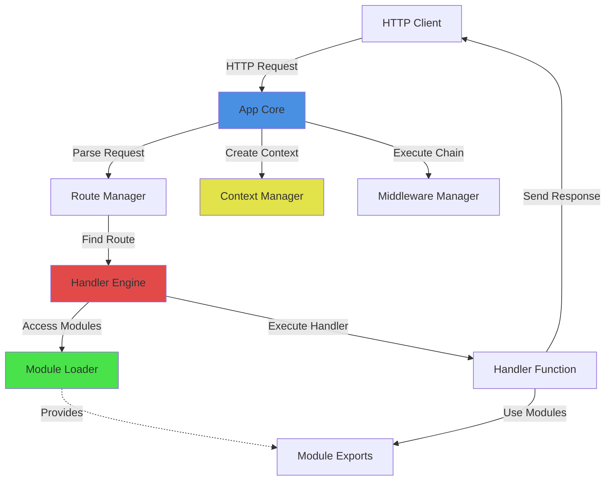

### Core Principles

1. **Simplicity**: Minimal abstraction, easy to understand
2. **Type Safety**: Full TypeScript support with strict types
3. **Modularity**: Reusable components via dependency injection
4. **Performance**: Zero-overhead abstractions where possible
5. **Developer Experience**: Fast feedback, hot reload, great tooling

## Core Components

### 1. App Core

**Location**: `src/runtime/app-core.ts`

**Purpose**: Main application orchestrator that manages the HTTP server, routing, and request lifecycle.

**Key Responsibilities**:
- Create and manage HTTP server
- Handle incoming requests
- Coordinate middleware execution
- Manage application lifecycle (startup, shutdown)
- Route registration API

**Architecture**:

```typescript
class GatiApp {
  private server: Server;
  private router: RouteManager;
  private middleware: MiddlewareManager;
  private gctx: GlobalContext;
  
  // Public API
  get(path, handler)      // Register GET route
  post(path, handler)     // Register POST route
  use(middleware)         // Add middleware
  listen()                // Start server
  close()                 // Stop server
}
```

**Request Handling Flow**:

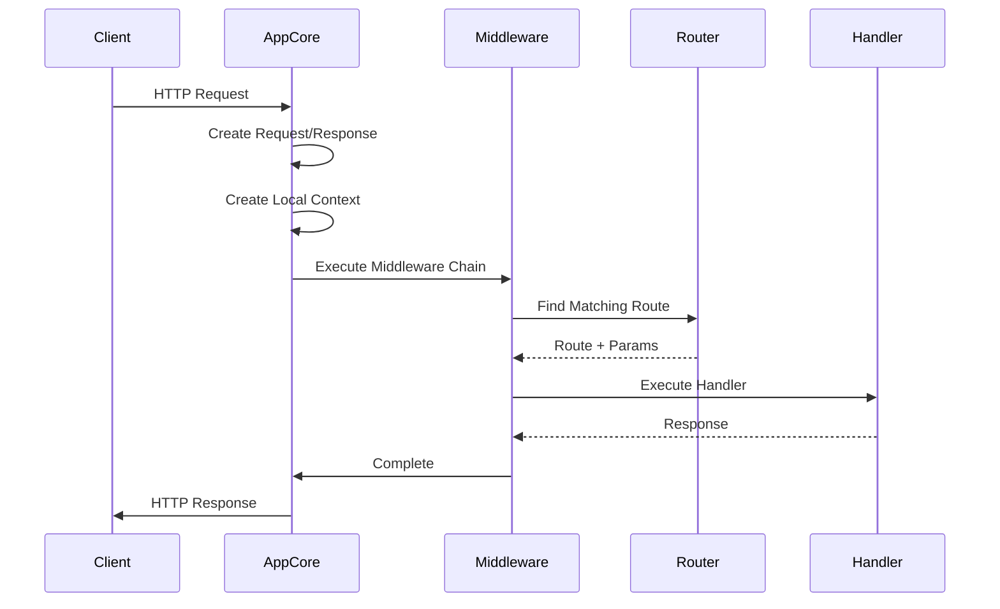

### 2. Handler Engine

**Location**: `src/runtime/handler-engine.ts`

**Purpose**: Executes handler functions with proper error handling, timeout management, and context injection.

**Key Responsibilities**:
- Validate handler functions
- Execute handlers with timeout protection
- Catch and format handler errors
- Provide consistent error responses

**Architecture**:

```typescript
async function executeHandler(
  handler: Handler,
  req: Request,
  res: Response,
  gctx: GlobalContext,
  lctx: LocalContext,
  options?: HandlerExecutionOptions
): Promise<void>
```

**Error Handling Flow**:

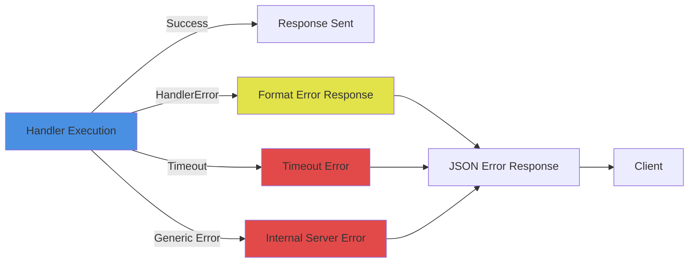

### 3. Route Manager

**Location**: `src/runtime/route-manager.ts`

**Purpose**: Manages route registration and matching with support for path parameters.

**Key Responsibilities**:
- Register routes with HTTP methods and paths
- Parse path patterns (e.g., `/users/:id`)
- Match incoming requests to registered routes
- Extract path parameters

**Architecture**:

```typescript
class RouteManager {
  private routes: Route[];
  
  register(method, path, handler)  // Register route
  match(method, path)              // Find matching route
  getRoutes()                      // List all routes
}
```

**Route Matching Algorithm**:

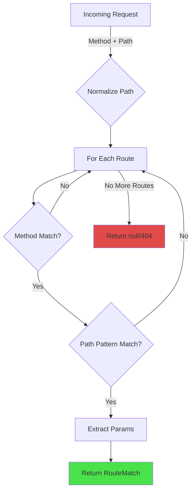

**Pattern Examples**:
- `/users` → Static path
- `/users/:id` → Dynamic segment
- `/users/:userId/posts/:postId` → Multiple parameters

### 4. Module Loader

**Location**: `src/runtime/module-loader.ts`

**Purpose**: Manages module lifecycle with dependency resolution and initialization.

**Key Responsibilities**:
- Register modules
- Resolve dependencies
- Initialize modules in correct order
- Detect circular dependencies
- Manage module lifecycle (init, shutdown, health checks)

**Architecture**:

```typescript
class ModuleLoader {
  private registry: ModuleRegistry;
  
  register(module, gctx)           // Register module
  initialize(name, gctx)           // Initialize module
  get(name, gctx)                  // Get module exports
  shutdown(name)                   // Shutdown module
  healthCheck()                    // Check all modules
}
```

**Dependency Resolution**:

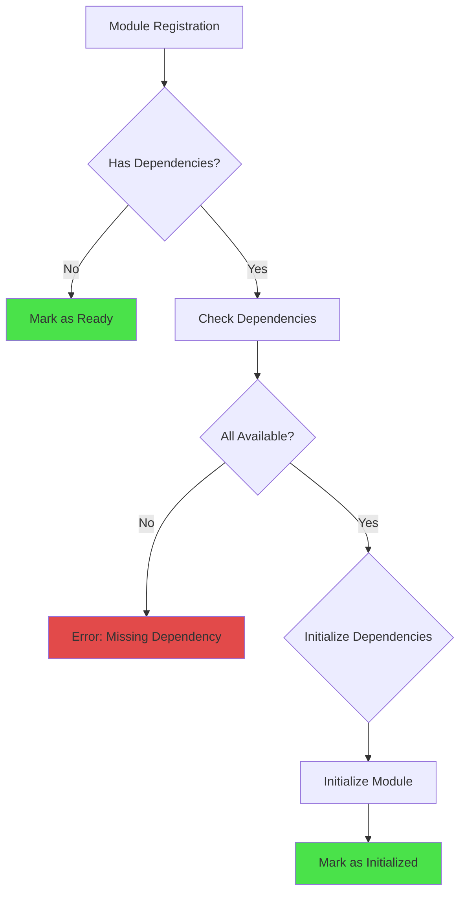

**Module States**:
- `uninitialized` → Registered but not initialized
- `initializing` → Currently being initialized
- `initialized` → Ready to use
- `error` → Initialization failed
- `shutdown` → Cleaned up

### 5. Context Manager

**Location**: `src/runtime/context-manager.ts`

**Purpose**: Manages global and local contexts with lifecycle hooks.

**Key Responsibilities**:
- Create global context (shared across requests)
- Create local context (per-request)
- Manage context lifecycle
- Execute cleanup hooks

**Architecture**:

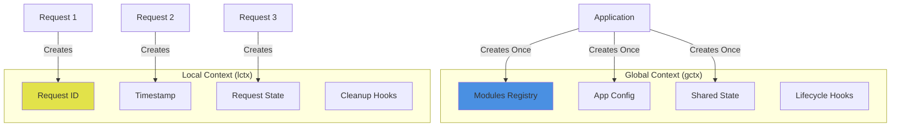

**Context Lifecycle**:

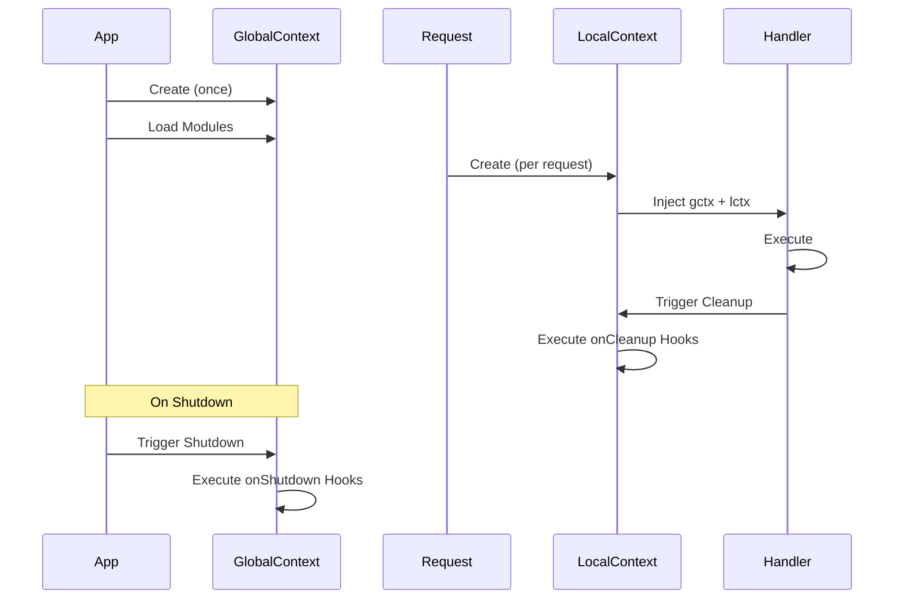

### 6. Middleware Manager

**Location**: `src/runtime/middleware.ts`

**Purpose**: Manages middleware chain execution with error handling.

**Key Responsibilities**:
- Register request middleware
- Register error middleware
- Execute middleware chain
- Handle middleware errors

**Middleware Chain**:

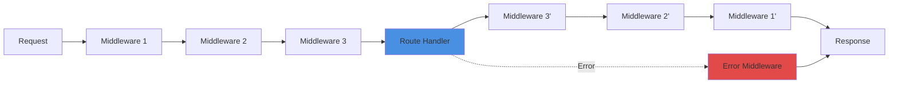

## Request Flow

### Complete Request Lifecycle

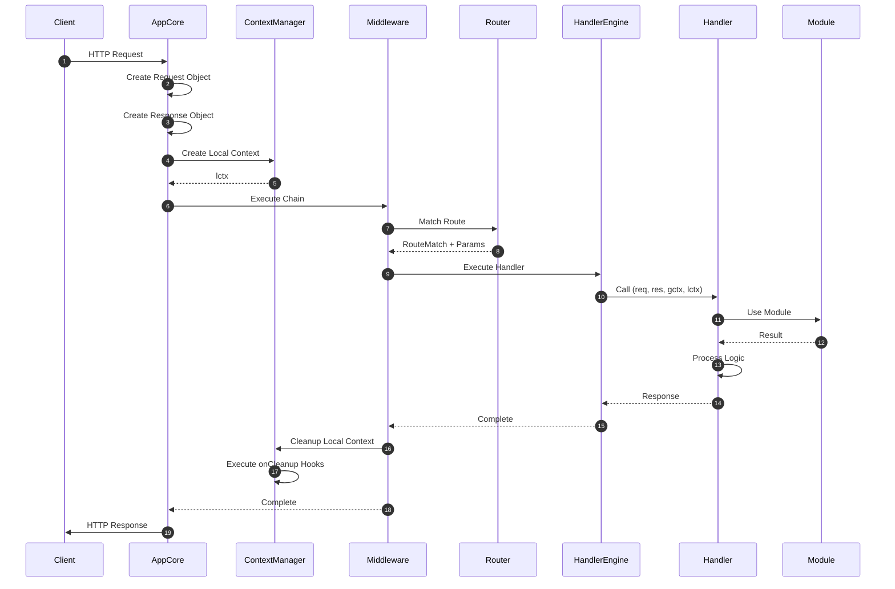

### Step-by-Step Breakdown

**1. Request Reception**
- HTTP server receives request
- Node.js `IncomingMessage` created

**2. Request Parsing**
- Create Gati `Request` object
- Parse URL, query parameters
- Parse request body (JSON)

**3. Context Creation**
- Create local context with unique ID
- Set request timestamp
- Initialize request state

**4. Middleware Execution**
- Execute logging middleware
- Execute authentication middleware
- Execute custom middleware

**5. Route Matching**
- Normalize request path
- Iterate through registered routes
- Match HTTP method and path pattern
- Extract path parameters

**6. Handler Execution**
- Validate handler function
- Set execution timeout
- Call handler with (req, res, gctx, lctx)
- Catch and format errors

**7. Module Access**
- Handler accesses modules via `gctx.modules`
- Module exports provide functionality
- Modules share resources (DB, cache, etc.)

**8. Response Generation**
- Handler calls response methods
- Set status code and headers
- Send JSON, text, or raw response

**9. Cleanup**
- Execute local context cleanup hooks
- Close request-scoped resources
- Log request completion

**10. Response Delivery**
- Send HTTP response to client
- Close connection (or keep-alive)

## Component Interactions

### Handler → Module Interaction

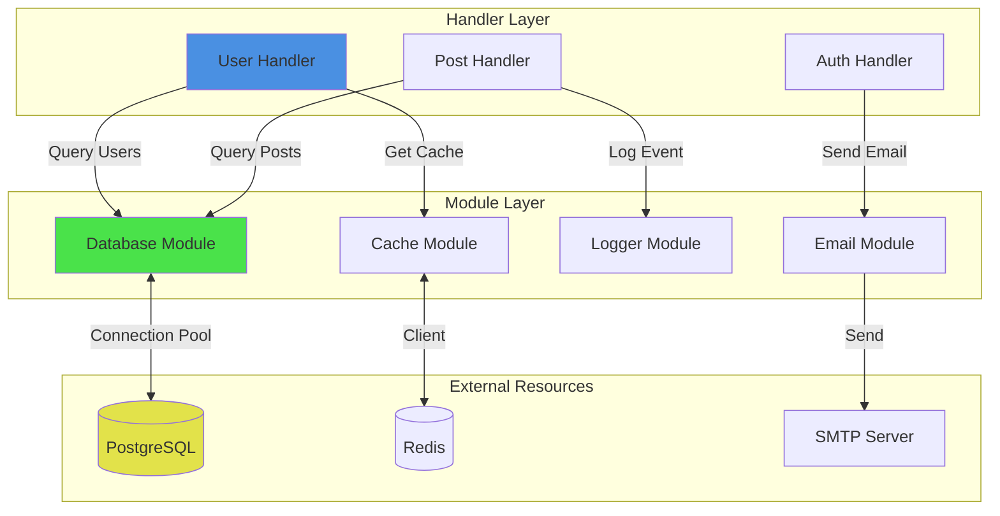

### Module Dependencies

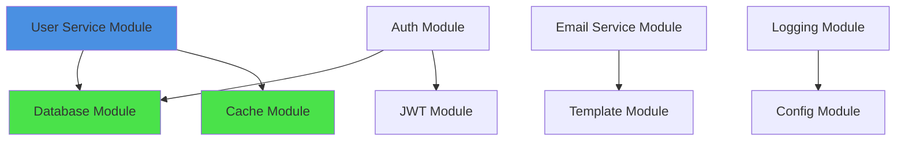

## Design Decisions

### 1. Handler Signature: Four Parameters

**Decision**: `handler(req, res, gctx, lctx)`

**Rationale**:
- **Explicit Context**: Clear separation of global vs. local state
- **Type Safety**: Each parameter is strongly typed
- **Testability**: Easy to mock context objects
- **Clarity**: No hidden dependencies

**Alternatives Considered**:
- Express-style `(req, res, next)` - Lacks context support
- Single context object - Less clear separation
- Dependency injection via decorators - More complex

### 2. Module Pattern: Functional vs. Class-Based

**Decision**: Support both patterns

**Rationale**:
- **Flexibility**: Developers choose based on needs
- **Simplicity**: Functions for simple modules
- **Power**: Classes for complex stateful modules
- **TypeScript**: Both work well with TypeScript

**Examples**:
```typescript
// Functional
export function createLoggerModule() { /* ... */ }

// Class-based
export class DatabaseModule implements Module { /* ... */ }
```

### 3. Error Handling: HandlerError Class

**Decision**: Custom `HandlerError` class with status code and context

**Rationale**:
- **Consistency**: Standardized error responses
- **Context**: Additional error information
- **HTTP Codes**: Built-in status code support
- **Type Safety**: TypeScript type checking

**Example**:
```typescript
throw new HandlerError('User not found', 404, { userId: '123' });
```

### 4. Context Split: Global vs. Local

**Decision**: Two separate context objects

**Rationale**:
- **Clarity**: Clear what's shared vs. request-scoped
- **Performance**: No overhead tracking scope
- **Safety**: Prevents accidental state leaks
- **Lifecycle**: Different cleanup requirements

**Usage**:
- `gctx` - Modules, config, shared state
- `lctx` - Request ID, timestamp, request state

### 5. Route Matching: Simple Pattern Matching

**Decision**: Basic pattern matching with `:param` syntax

**Rationale**:
- **Simplicity**: Easy to understand
- **Performance**: Fast matching algorithm
- **Predictability**: No regex complexity
- **Sufficiency**: Covers 95% of use cases

**Limitations**:
- No regex patterns
- No optional segments
- No wildcard matching

**Future**: Can be extended if needed

### 6. Module Loading: Lazy by Default

**Decision**: Modules initialize on first use unless configured otherwise

**Rationale**:
- **Fast Startup**: Don't initialize unused modules
- **Flexibility**: Configure eager loading if needed
- **Error Isolation**: Init errors don't crash app

**Configuration**:
```typescript
const loader = createModuleLoader({
  autoInit: true,  // Override for eager loading
});
```

## Extension Points

Gati provides several extension points for customization:

### 1. Custom Middleware

Add custom request processing:

```typescript
const customMiddleware: Middleware = async (req, res, gctx, lctx, next) => {
  // Before handler
  console.log('Before:', req.path);
  
  await next();
  
  // After handler
  console.log('After:', res.status);
};

app.use(customMiddleware);
```

### 2. Custom Modules

Create domain-specific modules:

```typescript
export function createMyModule(): Module<MyAPI> {
  return {
    name: 'myModule',
    version: '1.0.0',
    exports: { /* API */ },
    init: async (gctx) => { /* Setup */ },
    shutdown: async () => { /* Cleanup */ },
  };
}
```

### 3. Custom Error Handlers

Override default error handling:

```typescript
const errorHandler: ErrorMiddleware = (error, req, res, gctx, lctx) => {
  // Custom error formatting
  res.status(500).json({
    error: error.message,
    requestId: lctx.requestId,
    timestamp: lctx.timestamp,
  });
};

app.useError(errorHandler);
```

### 4. Custom Request/Response

Extend request/response objects:

```typescript
// Via middleware
const enhanceRequest: Middleware = async (req, res, gctx, lctx, next) => {
  (req as any).user = await authenticate(req);
  await next();
};
```

### 5. Plugin System (Future)

Planned plugin architecture:

```typescript
// Future API
const plugin: GatiPlugin = {
  name: 'my-plugin',
  version: '1.0.0',
  
  setup(app: GatiApp) {
    // Register routes, middleware, modules
    app.use(myMiddleware);
    app.get('/plugin-route', handler);
  },
};

app.plugin(plugin);
```

## Performance Considerations

### 1. Zero-Copy Request Parsing

- Minimal object creation
- Direct access to Node.js primitives
- No unnecessary transformations

### 2. Connection Pooling

- Database connection pools in modules
- Reuse connections across requests
- Configurable pool sizes

### 3. Lazy Module Loading

- Initialize modules on demand
- Reduce startup time
- Lower memory footprint

### 4. Efficient Route Matching

- O(n) route matching (linear scan)
- Early exit on first match
- Pre-compiled route patterns

### 5. Context Reuse

- Global context created once
- Local context pooled (future optimization)
- Minimal garbage collection

### Performance Tips

```typescript
// ✅ Good - Reuse module instances
const db = gctx.modules['db'];
await db.query(/* ... */);
await db.query(/* ... */);

// ❌ Bad - Repeated module lookups
await gctx.modules['db'].query(/* ... */);
await gctx.modules['db'].query(/* ... */);

// ✅ Good - Parallel queries
const [users, posts] = await Promise.all([
  db.query('SELECT * FROM users'),
  db.query('SELECT * FROM posts'),
]);

// ❌ Bad - Sequential queries
const users = await db.query('SELECT * FROM users');
const posts = await db.query('SELECT * FROM posts');
```

## Security Architecture

### 1. Input Validation

- Validate all user input
- Use Zod or similar schemas
- Sanitize data before use

### 2. Error Handling

- Never expose stack traces in production
- Log errors internally
- Return generic error messages

### 3. Module Isolation

- Modules don't share mutable state
- Each module has isolated initialization
- Clean shutdown prevents leaks

### 4. Context Isolation

- Local context per request
- No cross-request state leakage
- Automatic cleanup

### 5. Type Safety

- TypeScript strict mode
- No implicit `any` types
- Runtime type checking with Zod

### Security Best Practices

```typescript
// ✅ Good - Validate input
const schema = z.object({
  email: z.string().email(),
  password: z.string().min(8),
});

const result = schema.safeParse(req.body);
if (!result.success) {
  throw new HandlerError('Invalid input', 400);
}

// ✅ Good - Don't expose errors
try {
  await dangerousOperation();
} catch (error) {
  logger.error('Operation failed', error);
  throw new HandlerError('Operation failed', 500);
}

// ❌ Bad - Expose internal errors
catch (error) {
  res.json({ error: error.stack }); // Don't do this!
}
```

---

## Summary

Gati's architecture is designed for:
- **Simplicity**: Minimal abstractions, easy to understand
- **Performance**: Fast request handling, efficient resource use
- **Modularity**: Reusable components via dependency injection
- **Type Safety**: Full TypeScript support
- **Developer Experience**: Great tooling, hot reload, clear errors

The framework follows functional programming principles where possible while maintaining the flexibility for object-oriented patterns when beneficial.

---

**See Also:**
- [Getting Started Guide](../onboarding/getting-started.md)
- [Handler Development Guide](../guides/handlers.md)
- [Module Creation Guide](../guides/modules.md)
