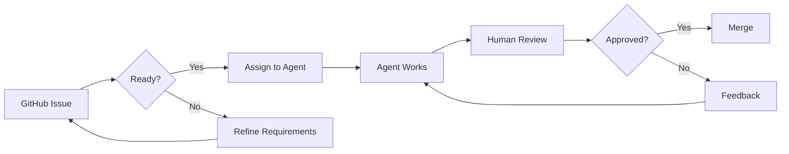

# 🤖 Agentic Development Guide for Gati

**Last Updated:** 2025-11-09  
**Framework:** Gati - Motion in Code  
**Development Mode:** AI-Assisted + Human Oversight

---

## 📋 Table of Contents

1. [Overview](#overview)
2. [Development Workflow](#development-workflow)
3. [Using GitHub Copilot Agent](#using-github-copilot-agent)
4. [Task Assignment Strategy](#task-assignment-strategy)
5. [Quality Gates](#quality-gates)
6. [Best Practices](#best-practices)
7. [Tools & Configuration](#tools--configuration)

---

## Overview

Gati uses an **agentic development approach** where AI coding agents (primarily GitHub Copilot) work alongside human developers to accelerate development while maintaining code quality.

### Key Principles

1. **AI for Implementation, Human for Direction** - Humans define requirements, AI implements
2. **Incremental Progress** - Small, reviewable changes over large rewrites
3. **Test-Driven** - AI generates tests alongside implementation
4. **Documentation First** - Every feature includes docs
5. **Quality Gates** - Automated checks before merge

---

## Development Workflow

### Phase 1: Task Selection



**Steps:**

1. Select issue from [Milestone 1 board](https://github.com/krishnapaul242/gati/milestone/1)
2. Verify acceptance criteria are clear
3. Check dependencies are complete
4. Assign to Copilot or work with Copilot Chat

---

### Phase 2: Implementation

#### Using GitHub Copilot Agent (Direct Assignment)

For well-defined tasks, assign directly:

```bash
# Via GitHub CLI
gh issue view 1
gh copilot assign 1

# Or via GitHub UI
# Navigate to issue → "Assign to Copilot" button
```

**What Copilot Does:**

- Reads issue description and acceptance criteria
- Analyzes codebase context
- Creates implementation plan
- Writes code + tests
- Commits to a branch
- Opens PR with detailed description

**When to Use:**

- ✅ Task has clear acceptance criteria
- ✅ Dependencies are satisfied
- ✅ File paths specified in issue
- ✅ Limited ambiguity

---

#### Using Copilot Chat (Interactive)

For complex or exploratory tasks:

```
@workspace Let's work on #1 - Handler Execution Pipeline

Requirements:
- Implement Request and Response objects
- Create context managers (gctx, lctx)
- Handler signature: handler(req, res, gctx, lctx)

Files to create:
- src/runtime/handler-engine.ts
- src/runtime/types/request.ts
- src/runtime/types/response.ts

Please start with the type definitions.
```

**When to Use:**

- ✅ Need iterative refinement
- ✅ Want to discuss architecture first
- ✅ Multiple approaches to consider
- ✅ Learning new patterns

---

### Phase 3: Review & Merge

#### Automated Checks

Every PR must pass:

```yaml
# .github/workflows/pr-checks.yml
- TypeScript compilation
- ESLint (no errors)
- Unit tests (>80% coverage)
- Integration tests (if applicable)
- Build succeeds
```

#### Human Review Checklist

```markdown
- [ ] Code matches acceptance criteria
- [ ] Tests cover edge cases
- [ ] Documentation updated
- [ ] No security vulnerabilities
- [ ] Performance acceptable
- [ ] Follows project conventions
- [ ] Comments explain "why", not "what"
```

---

## Using GitHub Copilot Agent

### Configuration

Create `.github/copilot-instructions.md`:

````markdown
# Copilot Instructions for Gati

## Project Context

Gati is a cloud-native Node.js framework for versioned APIs.

## Code Style

- TypeScript strict mode
- Functional > OOP where possible
- Clear, descriptive names
- Comments for complex logic only

## Testing Requirements

- Unit tests for all public APIs
- Use Vitest framework
- Test edge cases and errors
- Mock external dependencies

## File Structure

Follow the structure in MILESTONES.md - files are pre-specified per task.

## Import Conventions

```typescript
// External imports first
import { createServer } from 'http';

// Internal imports second
import { Handler } from './types/handler';
import { Context } from './types/context';
```
````

## Error Handling

- Use custom error classes
- Always include error context
- Log errors with structured logging

````

### Issue Templates for AI

Create `.github/ISSUE_TEMPLATE/ai-task.md`:

```markdown
---
name: AI Agent Task
about: Task specification for AI coding agents
labels: ai-task, M1
---

## 🎯 Objective
[One sentence: what needs to be built]

## 📝 Requirements

### Functional
- [ ] Requirement 1
- [ ] Requirement 2

### Non-Functional
- [ ] Performance: [specific metric]
- [ ] Security: [specific requirement]

## 📁 Files to Create/Modify

### Create
- `path/to/file1.ts` - [purpose]
- `path/to/file2.ts` - [purpose]

### Modify
- `path/to/existing.ts` - [what to change]

## ✅ Acceptance Criteria

- [ ] Criterion 1 (testable)
- [ ] Criterion 2 (testable)

## 🧪 Test Requirements

```typescript
// Example test structure
describe('FeatureName', () => {
  it('should handle basic case', () => {});
  it('should handle error case', () => {});
});
````

## 📚 Context & References

- Related issues: #X, #Y
- Design docs: [link]
- Similar code: `path/to/example.ts`

## 🚫 Out of Scope

- Thing 1
- Thing 2

## 💡 Implementation Hints

[Optional: architectural guidance, preferred patterns]

````

---

## Task Assignment Strategy

### Task Categories

| Category | Approach | Example |
|----------|----------|---------|
| **Well-Defined** | Assign to Copilot Agent | "Implement TypeScript config" |
| **Exploratory** | Interactive Copilot Chat | "Design context manager architecture" |
| **Critical Path** | Pair: Human + Copilot | "Handler execution flow" |
| **Documentation** | Copilot writes, Human reviews | "Getting Started guide" |

### Milestone 1 Assignment Plan

#### Week 1: Foundation
```bash
# ✅ Completed by human
Issue #12: Setup Monorepo (Completed manually)
Issue #13: TypeScript Config (Completed manually)

# 🤖 Assign to Copilot
gh copilot assign 7  # Context Managers (low risk, clear spec)
````

#### Week 2: Core Runtime

```bash
# 💬 Interactive Development
# Open Copilot Chat:
"Let's work on #1 - Handler Pipeline. This is critical.
I want to discuss the architecture first before implementing."

# After architecture finalized:
gh copilot assign 1  # Handler Pipeline
```

#### Week 3: Routing

```bash
# 🤖 Direct Assignment (dependencies ready)
gh copilot assign 6  # Route Registration
```

#### Week 4-5: Integration

```bash
# 💬 Interactive (complex integration)
"Let's integrate all components for #8 - App Core.
Show me how the pieces fit together first."
```

---

## Quality Gates

### Before AI Implementation

```markdown
Checklist:

- [ ] Issue has clear acceptance criteria
- [ ] Dependencies satisfied (check MILESTONES.md)
- [ ] File paths specified
- [ ] Test requirements documented
- [ ] Example code provided (if complex)
```

### During Implementation

```markdown
Monitor:

- PR description explains changes
- Commits are logical and atomic
- Tests written alongside code
- No compilation errors
- CI passes
```

### After Implementation

```markdown
Review:

- [ ] Run locally: `npm install && npm test`
- [ ] Code matches issue requirements
- [ ] Edge cases covered
- [ ] Documentation updated
- [ ] No performance regressions
- [ ] Security best practices followed
```

---

## Best Practices

### 1. Start Small

```
❌ "Implement entire handler system"
✅ "Implement Request type definition"
```

### 2. Provide Context

```
❌ "@workspace write handler code"
✅ "@workspace Implement handler execution based on #1.
Reference Express.js middleware pattern but use our
signature: handler(req, res, gctx, lctx)"
```

### 3. Iterate on Feedback

```
Agent: [creates PR]
You: "Good start, but we need error boundaries. See Milestone doc."
Agent: [updates PR with error handling]
```

### 4. Use Examples

```
"Implement module loader similar to:
- Node.js require() for discovery
- Webpack plugins for lifecycle
- NestJS modules for DI

See examples/hello-world for usage pattern."
```

### 5. Test First (Sometimes)

```
"Before implementing handler-engine.ts, create tests in
handler-engine.test.ts that define expected behavior."
```

---

## Tools & Configuration

### Required Tools

```bash
# GitHub CLI with Copilot
brew install gh
gh extension install github/gh-copilot

# VS Code with extensions
code --install-extension GitHub.copilot
code --install-extension GitHub.copilot-chat

# Node.js tooling
npm install -g pnpm
```

### Project Setup

```bash
# Clone repo
git clone https://github.com/krishnapaul242/gati.git
cd gati

# Install dependencies (when package.json exists)
pnpm install

# Create .env for local development
cp .env.example .env

# Verify setup
pnpm typecheck
pnpm test
```

### VS Code Settings

Create `.vscode/settings.json`:

```json
{
  "github.copilot.enable": {
    "*": true,
    "yaml": true,
    "plaintext": false,
    "markdown": true
  },
  "github.copilot.advanced": {
    "debug.overrideEngine": "gpt-4",
    "inlineSuggest.count": 3
  },
  "editor.inlineSuggest.enabled": true,
  "editor.formatOnSave": true,
  "typescript.tsdk": "node_modules/typescript/lib"
}
```

---

## Example: Working on Issue #1

### Step 1: Review Issue

```bash
gh issue view 1
```

Output shows:

- Description: Handler execution pipeline
- Files to create: handler-engine.ts, request.ts, response.ts
- Acceptance criteria: 4 specific points

### Step 2: Choose Approach

**Option A: Direct Assignment**

```bash
gh copilot assign 1
# Wait for PR
# Review when ready
```

**Option B: Interactive Development**

Open VS Code → Copilot Chat:

```
You: @workspace Let's work on #1 step by step.

First, show me the type definitions for Request and Response
based on Express.js but adapted for our context system.

Copilot: [generates src/runtime/types/request.ts]

You: Good! Now add query params and path params extraction.

Copilot: [updates types]

You: Perfect. Create the file and let's move to handler-engine.ts
```

### Step 3: Review PR

```bash
# Checkout PR branch
gh pr checkout 123

# Run tests
pnpm test

# Manual testing
pnpm dev

# If good:
gh pr review 123 --approve
gh pr merge 123
```

---

## Troubleshooting

### "Agent got stuck or incorrect implementation"

**Solution:**

```bash
# Close PR
gh pr close 123

# Create new branch manually
git checkout -b fix/issue-1-take-2

# Use interactive Copilot Chat with more guidance
```

### "Too many changes in one PR"

**Solution:**

```
Break into sub-tasks:
#1.1: Request/Response types
#1.2: Context initialization
#1.3: Handler execution flow
#1.4: Error handling
```

### "Tests failing"

**Solution:**

```
"@workspace The tests for handler-engine are failing.
Here's the error: [paste error].
Please fix the implementation in handler-engine.ts."
```

---

## Metrics & Tracking

### Dashboard (Weekly Update)

| Metric           | Target   | Current |
| ---------------- | -------- | ------- |
| Issues completed | 2-3/week | -       |
| Test coverage    | >80%     | -       |
| PR review time   | <24h     | -       |
| AI accuracy      | >90%     | -       |

### AI Effectiveness

Track in `AGENTIC_METRICS.md`:

```markdown
| Issue | Method | Human Time | AI Saves | Quality |
| ----- | ------ | ---------- | -------- | ------- |
| #1    | Chat   | 2h review  | ~8h code | 9/10    |
| #12   | Human  | 1h         | N/A      | 10/10   |
```

---

## Next Steps

1. ✅ Review this guide
2. ✅ Setup tools (gh, Copilot)
3. ✅ Create `.github/copilot-instructions.md`
4. ✅ Test with one small issue (e.g., #7)
5. ✅ Iterate on workflow
6. ✅ Scale to more complex tasks

---

## Resources

- [GitHub Copilot Docs](https://docs.github.com/en/copilot)
- [Copilot CLI Guide](https://cli.github.com/manual/gh_copilot)
- [VS Code Copilot](https://code.visualstudio.com/docs/copilot/overview)
- [Gati Milestones](./MILESTONES.md)
- [Task Breakdown](./.github/m1-tasks-breakdown.md)

---

**Remember:** AI is a force multiplier, not a replacement. You architect, review, and decide. AI implements, tests, and documents.

🚀 **Let's build Gati together!**
